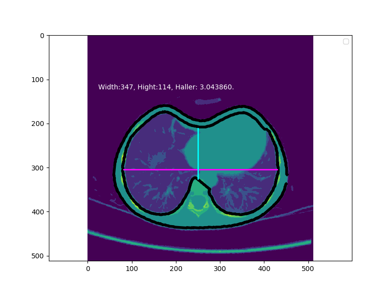

# 胸部Haller指数自动检测
检测方法基于 paper 文件夹下的两篇论文。

## 安装
本项目建议基于Anaconda3 环境进行安装。
### 安装依赖包
```
pip install tornado opencv-python pydicom
```
### 启动服务
```
python service.py
```

## 使用说明
前端接口默认使用论文2的方法
```
http://127.0.0.1:10001/yuyi/api/chest/index.html
```
python接口
```python
# 基于论文二的检测方法
from src import diagnosis_v2
h, figure = diagnosis_v2(f)
```
Web api接口
使用ajax请求 (将【your server ip 】替换为你的服务器ip地址，如果是本机则为127.0.0.1)
```js
function postData(files){
	var formData = new FormData();
	$.each(files,function(i,file){
		formData.append('file['+i+']', file);
	});
    $.ajax({
        url:'http://[your server ip]:10001/yuyi/api/chest/v2', /*接口域名地址*/
        type:'post',
        data: formData,
        contentType: false,
        processData: false,
        success:function(res){
            if(res["result"]=="ok"){
				$("#dicom_result").attr('src', 'data:image/png;base64,' + res.figure);
            }else if(res["result"]=="err"){
                alert('失败');
            }else{
                console.log(res);
			}
			
        }
    })
}
```

## 效果展示
使用本项目Haller指数检测结果如图所示

