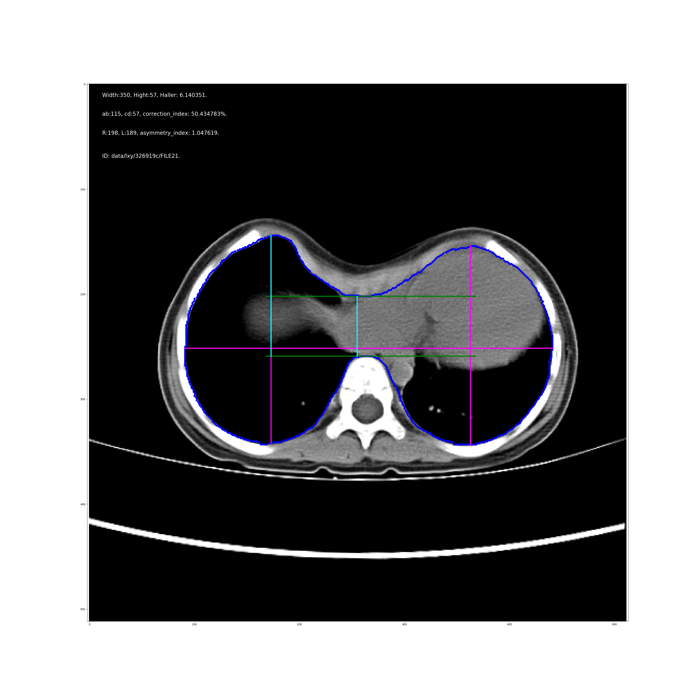

# 胸部Haller指数自动检测
检测方法基于 paper 文件夹下的两篇论文。

## 安装
本项目建议基于Anaconda3 环境进行安装。
### 安装依赖包
```
pip install tornado opencv-python pydicom
```
### 启动服务
```
python service.py
```

## 使用说明
前端接口默认使用论文2的方法
```
http://127.0.0.1:10001/yuyi/api/chest/index.html
```
python接口
```python
# 基于论文二的检测方法
from src import diagnosis_folder
figure, haller_index = diagnosis_folder("/path/to/ct_dir", top=1)
figure[0].save("HallerResult.png")
```

## 效果展示
使用本项目Haller指数检测结果如图所示

